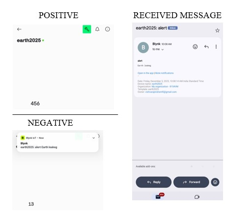

# E-Guard-Smart-Surveillance-System-for-Earthing-Health-in-Electrical-Poles
Pole Protector is a smart system that Monitors earth resistance, leakage current, and continuity.Detects faults in real-time.Alerts staff immediately with LED, buzzer, and display signals. 
# E-Guard: Smart Surveillance System for Earthing Health in Electrical Poles

The system monitors the healthiness of electrical pole earthing systems using leakage current sensing, continuity checking, and voltage monitoring techniques. The device provides real-time monitoring, detects unsafe conditions, and generates immediate alerts for maintenance staff using IoT-based communication and industrial electronics concepts.

---

# E-Guard: Smart Surveillance System for Earthing Health in Electrical Poles

An IoT-based industrial electronics project developed using ESP8266 Wi-Fi controller, leakage sensing circuits, MOSFET switching, voltage monitoring, and alert systems for real-time electrical pole safety monitoring applications.

---

# Project Overview

Electrical poles and outdoor lighting systems are critical public infrastructure components. Improper earthing, leakage current, broken grounding wires, and voltage abnormalities may lead to electric shock hazards, equipment damage, fire accidents, and public safety risks.

Conventional earthing inspection methods are manual, time-consuming, and unable to provide continuous monitoring. Existing protection devices such as ELCB and RCCB only operate during severe leakage conditions and cannot continuously monitor the overall healthiness of earthing systems.

This project proposes:
- Real-time earthing health monitoring
- Leakage current detection
- Earthing continuity monitoring
- Voltage sensing
- IoT-based fault notification
- Automatic alert generation
- Portable and scalable monitoring system

The proposed system improves electrical safety, reduces manual maintenance effort, and enables continuous surveillance of earthing conditions using low-cost industrial electronics components.

---

# Features

- Real-time earthing health monitoring
- Leakage current detection
- Earthing continuity checking
- Voltage sensing and protection
- ESP8266 Wi-Fi based IoT monitoring
- LED and buzzer fault indication
- Battery backup support
- MOSFET-based load control
- Portable prototype implementation
- Low-cost industrial safety system
- Continuous monitoring capability
- Wireless alert transmission
- Smart electrical safety solution

---

# Components Used

| S.No | Component |
|------|-----------|
| 1 | ESP8266 Wi-Fi Controller |
| 2 | ACS712 Current Sensor |
| 3 | Voltage Sensor Module |
| 4 | Potentiometer |
| 5 | MOSFET Switching Circuit |
| 6 | LED Indicators |
| 7 | Buzzer |
| 8 | Step-Down Transformer |
| 9 | Bridge Rectifier |
| 10 | Capacitor Filter |
| 11 | Voltage Regulator (7805) |
| 12 | Battery Backup |
| 13 | Continuity Check Circuit |
| 14 | Jumper Wires |
| 15 | Miniature Electrical Pole Model |

---

# Working Principle

1. AC supply is converted into regulated 5V DC using:
   - Step-down transformer
   - Bridge rectifier
   - Filter capacitor
   - Voltage regulator

2. Sensors continuously monitor:
   - Leakage current
   - Voltage level
   - Earthing continuity

3. ESP8266 receives sensor data in real time.

4. The controller compares sensor readings with predefined threshold values.

5. If the system is healthy:
   - Normal monitoring continues
   - Safe status is maintained

6. If a fault condition occurs:
   - LED alert is activated
   - Buzzer warning is triggered
   - Fault message is transmitted through IoT monitoring

7. MOSFET switching circuit can disconnect the faulty load during severe fault conditions.

---

# Proposed Solution

The proposed system combines industrial electronics protection circuits and IoT-based monitoring techniques for continuous earthing health surveillance in electrical poles. Leakage current sensing, voltage monitoring, and continuity checking circuits are integrated with an ESP8266 Wi-Fi controller for real-time fault detection. The system provides immediate alerts using LED indicators, buzzer alarms, and wireless notifications. MOSFET-based switching enables automatic load isolation during unsafe conditions. The proposed solution improves public electrical safety while reducing manual maintenance efforts.

---

# Block Diagram

---

# Circuit Diagram

---

# Flow Diagram

---

# Project Images

## Hardware Setup

## Prototype Model

## Output Indication

---

# Software Used

- Arduino IDE
- Embedded C Programming
- Blynk IoT Platform

---

# Technologies Used

- Industrial Electronics
- Embedded Systems
- IoT Monitoring
- Leakage Current Detection
- Voltage Monitoring
- MOSFET Switching
- Wireless Communication
- Electrical Safety Systems

---

# Industrial Electronics Concepts Used

## Power Devices
- MOSFET switching
- Rectifier diodes
- Voltage regulators
- Protection circuits

## Converters
- AC to DC conversion
- Regulated DC power supply

## Switching & Protection
- Fault isolation
- Load control
- Overvoltage protection

## IoT Integration
- ESP8266 wireless communication
- Real-time remote monitoring

---

# Applications

## Electrical Pole Safety Monitoring
The system continuously monitors earthing health in electrical poles and public lighting systems to prevent electric shock hazards and equipment damage.

## Industrial Electrical Safety
Industries can use the system for real-time monitoring of grounding systems, electrical panels, and leakage protection circuits.

## Smart City Infrastructure
The project supports IoT-based smart city monitoring systems for public electrical safety and preventive maintenance.

## Railway & Parking Area Monitoring
The system can be deployed in railway stations, parking lots, and public utility areas where large numbers of electrical poles are installed.

---

# Advantages

- Continuous real-time monitoring
- Low-cost implementation
- Reduced manual inspection effort
- Immediate fault alerts
- Improved public safety
- Portable and scalable system
- Supports IoT-based monitoring
- Industrial electronics protection features
- Fast response time
- Easy maintenance
- Low power consumption
- Suitable for smart city applications

---

# Limitations

- Requires proper sensor calibration
- Wireless communication depends on network availability
- Outdoor environmental conditions may affect sensors
- Prototype implementation limited to small-scale testing

---

# Output

The system successfully:
- Detects earthing faults
- Monitors leakage current
- Checks earthing continuity
- Generates real-time alerts
- Supports IoT-based monitoring
- Improves electrical safety monitoring
- Demonstrates industrial electronics protection concepts

---

# Future Enhancements

- AI-based fault prediction
- GPS-based pole location tracking
- Cloud database integration
- Solar-powered monitoring system
- Advanced industrial fault diagnostics
- Mobile application integration
- Smart grid connectivity
- Automatic maintenance scheduling

---

# Literature Survey References

1. Rashid, M. H.,
   “Power Electronics: Circuits, Devices and Applications,”
   Pearson Education, 2014.

2. Mohan, N. et al.,
   “Power Electronics: Converters, Applications and Design,”
   Wiley Publications, 2003.

3. IEEE Standards Association,
   “Grounding and Earthing Safety Standards,”
   IEEE Electrical Safety Guidelines.

4. Industrial Electrical Safety Handbook,
   “Leakage Protection and Earthing Monitoring Systems,”
   Industrial Automation Publications.

---

# Repository Structure

├── Arduino_Code  
├── Circuit_Diagram  
├── Flow_Diagram  
├── Images  
├── PPT  
├── Report  
└── README.md  

---

# Authors

Developed as an academic Industrial Electronics Applications project by ECE students.

### Team Members
- Sathyanarayanan S
- Sharmilan M
- Vishva R
- Varun P

---

# Institution

Department of Electronics and Communication Engineering  
K. Ramakrishnan College of Engineering  
(Autonomous)

---

# License

This project is licensed under the MIT License.

---

# Conclusion

E-Guard: Smart Surveillance System for Earthing Health in Electrical Poles provides a reliable, low-cost, and intelligent solution for electrical safety monitoring. By integrating industrial electronics protection techniques with IoT-based communication, the system enables continuous monitoring of earthing conditions and immediate fault detection. The proposed system improves public safety, reduces maintenance effort, and supports future smart electrical infrastructure applications.
